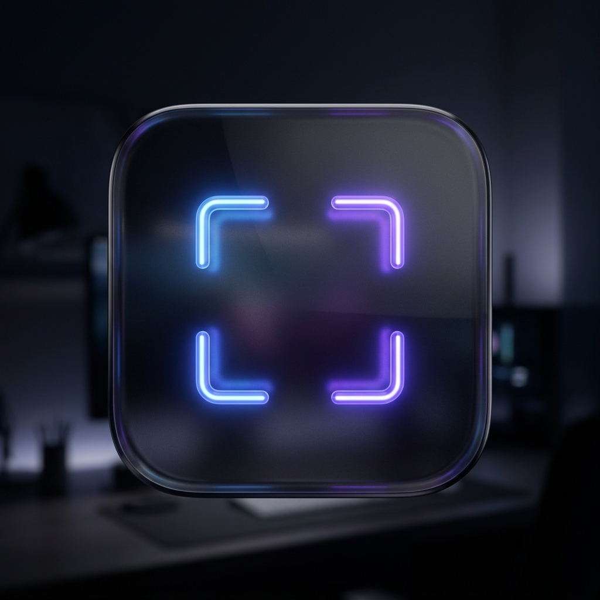

# FocusDesk

FocusDesk is a modern, lightweight, 100% local macOS menu bar utility designed to eliminate workspace distractions. With a single customizable keyboard shortcut (default: `⌥F`), it isolates your workspace by instantly minimizing all background windows across all displays. Pressing the shortcut again restores them to their exact prior state.

<p align="center">
  
</p>

## Key Features

- **Isolate Workspace**: Instantly hides/minimizes all other windows, leaving only the active frontmost window visible.
- **Toggle Restore**: Restores the previously visible windows to their exact prior positions and layouts.
- **Custom Global Shortcuts**: Configurable global hotkeys (default: `Option + F`) registered via Carbon APIs for zero CPU polling overhead.
- **Preferences Panel**: Native SwiftUI settings panel allowing you to record custom shortcuts and toggle window isolation behaviors.
- **Accessibility Onboarding**: Elegant first-run setup window that detects system authorization in real-time and dismisses automatically.
- **100% Local & Lightweight**: Zero external cloud dependencies, built directly with native AppKit, Carbon, and SwiftUI. Memory footprint stays well below 30-50MB RAM.
- **Command Line Build**: Compile directly using the macOS Command Line Tools SDK (`swiftc`) without needing the full Xcode IDE.

---

## Getting Started

### Prerequisites

- macOS 14.0 Sonoma or later.
- macOS Command Line Tools (install via `xcode-select --install` if not already installed).

### Compilation & Build

To build the application bundle manually:

1. Clone or copy the project files to a local directory.
2. Run the build script:
   ```bash
   ./build.sh
   ```
3. The compiled `.app` bundle is generated at:
   ```
   build/FocusDesk.app
   ```

### Running the Application

Double-click `build/FocusDesk.app` in Finder, or run:
```bash
open build/FocusDesk.app
```

On first launch, you will be guided to enable Accessibility permissions in **System Settings > Privacy & Security > Accessibility**. Once enabled, FocusDesk will automatically activate and run in your menu bar.

---

## Codebase Structure

The source code is organized into a clean, modular structure:

- **[src/main.swift](src/main.swift)**: Manages application lifecycle (`NSApplicationDelegate`), status bar menu item initialization, and window presentation.
- **[src/FocusEngine.swift](src/FocusEngine.swift)**: Coordinates window enumeration, isolation, and state restoration via AppKit and Accessibility APIs.
- **[src/KeyboardShortcutManager.swift](src/KeyboardShortcutManager.swift)**: Handles Carbon global hotkey binding and local keyboard event tracking.
- **[src/PreferencesView.swift](src/PreferencesView.swift)**: SwiftUI interface for setting custom keyboard shortcuts and toggling focus mode options.
- **[src/OnboardingView.swift](src/OnboardingView.swift)**: SwiftUI overlay guiding the user to grant Accessibility permissions.
- **[src/Info.plist](src/Info.plist)**: App configuration declaring FocusDesk as an agent application (`LSUIElement`).

---

## License

This project is licensed under the MIT License.
